# API Portfolio App

A multi-page **Streamlit** web application that demonstrates real-world API integrations across five distinct domains — weather, space, gaming, music, and gaming lore. Built as a portfolio project to showcase Python development skills, API authentication patterns, data visualization, and UI/UX design.

---

## Live Demo

[▶ Watch Demo Walkthrough](https://github.com/Loehnert12/API_Portfolio/releases/download/v1.0/demo_walkthrough.mp4)

---

## Pages

### Home

The landing page introduces the project and its purpose. It features a profile section, a summary of all five API integrations displayed as interactive cards, and a tech stack badge row.

<!-- Screenshot: Home page with profile card and feature tiles -->
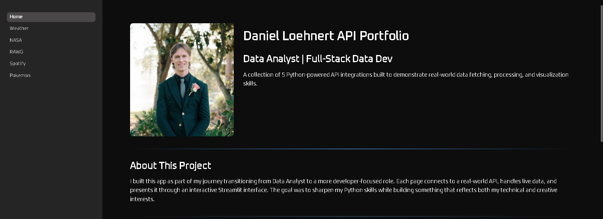
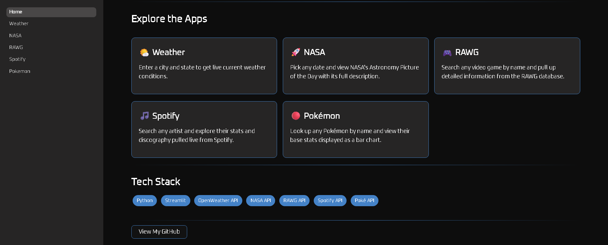

---

### Weather — Open-Meteo API

Enter any **City, State** (e.g., `Tampa, FL`) and get a live current-conditions snapshot:

- Temperature & Apparent Temperature
- Wind Speed & Wind Gusts
- Humidity
- Precipitation

Uses the **Open-Meteo** geocoding and forecast APIs — no API key required. City input is geocoded to latitude/longitude before fetching weather data.

<!-- Screenshot: Weather page with metric cards -->
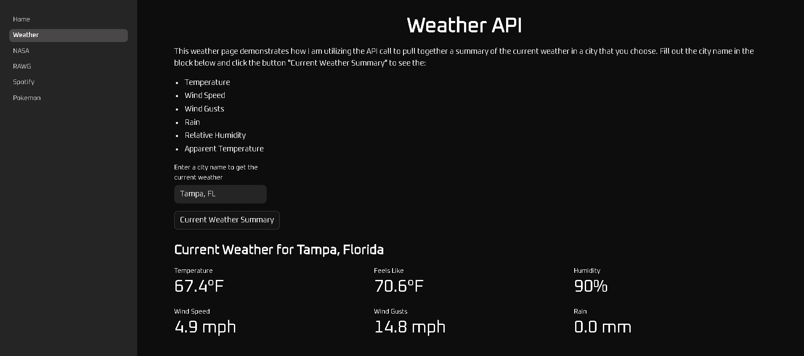

---

### NASA — Astronomy Picture of the Day

Pick any date back to **June 16, 1995** and load NASA's Astronomy Picture of the Day for that date. The app handles both image and embedded video results, and displays the title, copyright credit, and full explanation in a styled card.

Includes retry logic (up to 3 attempts) to gracefully handle intermittent NASA API 503 responses.

<!-- Screenshot: NASA APOD page showing an image with explanation card -->
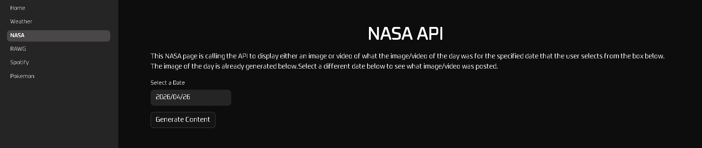
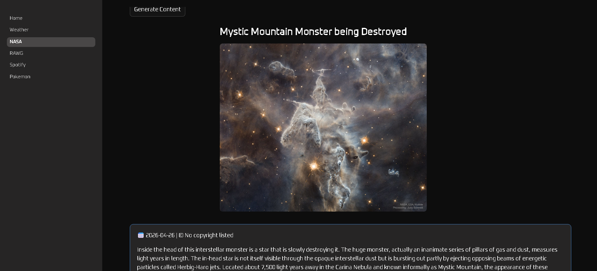
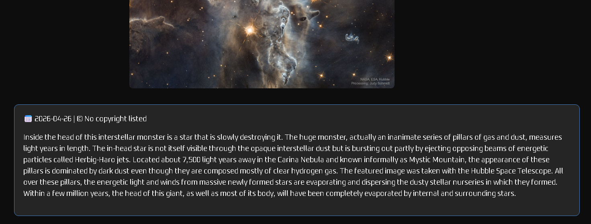

---

### RAWG — Video Game Database

Search any video game title to retrieve detailed stats pulled from the **RAWG** database:

- Metacritic Score & User Rating
- Genre(s) & Supported Platforms
- ESRB Rating
- Average Playtime

Results display as image + stat card pairs. The page also auto-loads a **Top Rated Games** section — a 2×5 grid of the ten highest-rated games on RAWG.

<!-- Screenshot: RAWG page showing game search results and top-rated grid -->
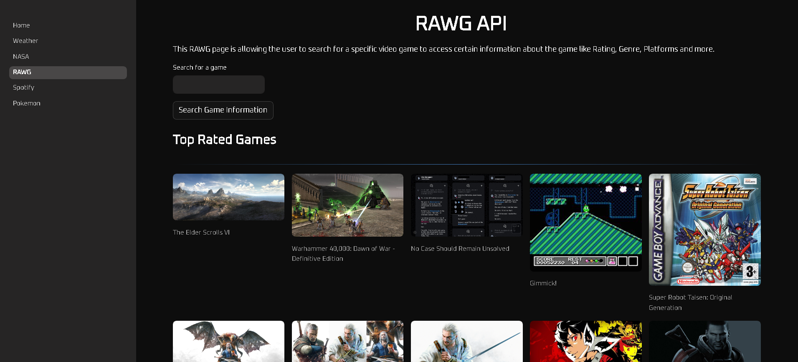
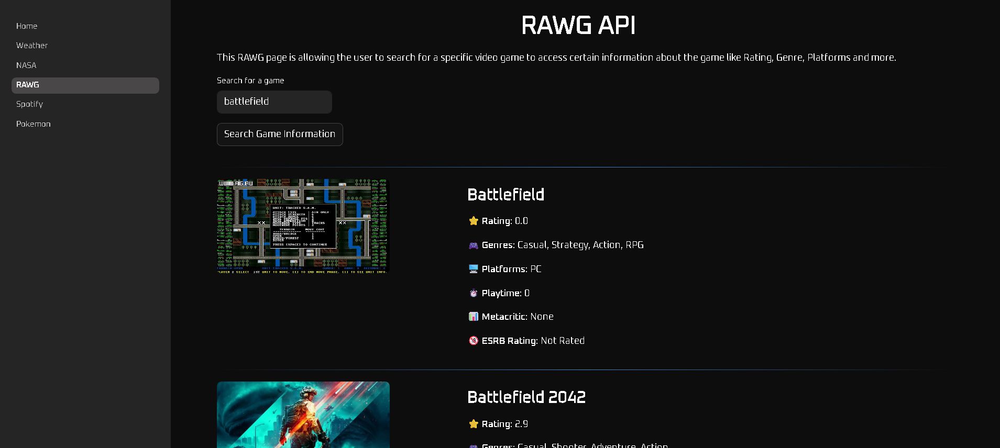
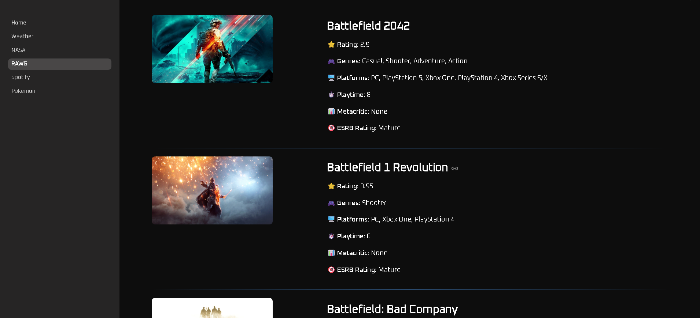

---

### Spotify — Artist Explorer

Search any artist to pull their **Spotify** profile data:

- Artist photo and name
- Direct link to open their profile in Spotify
- Four-column album grid showing their top releases

Authentication uses the **OAuth 2.0 Client Credentials** flow — the app exchanges a Client ID + Secret for a bearer token on each request, without requiring user login.

<!-- Screenshot: Spotify page showing artist profile and album grid -->
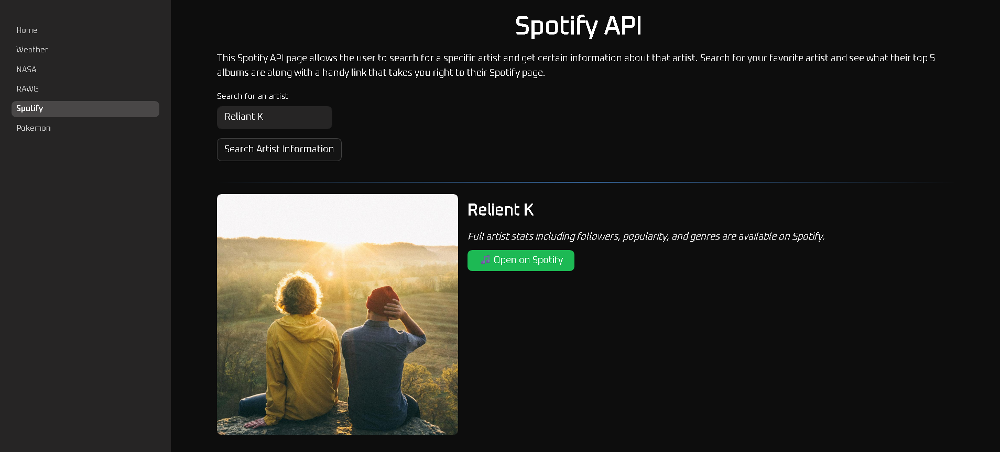
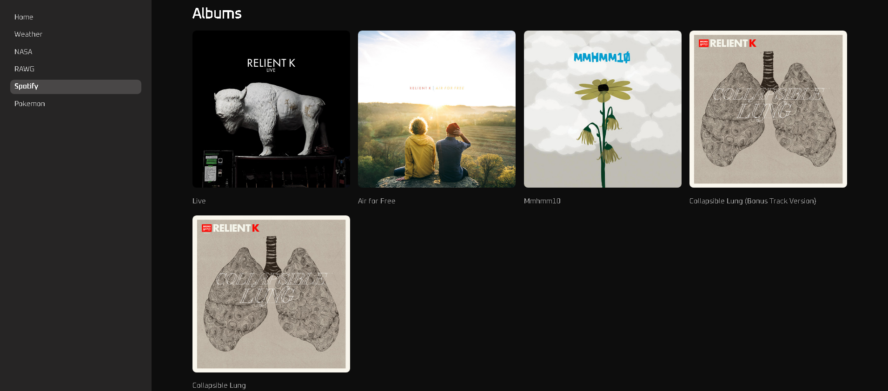

---

### Pokémon — Pokédex Stats

Search any Pokémon by name to display its full Pokédex entry:

- Official artwork sprite
- ID, Type(s), Height, Weight, Base Experience
- Interactive horizontal bar chart of all six base stats (HP, Attack, Defense, Sp. Atk, Sp. Def, Speed)

Built with **PokéAPI** (free, no key required) and visualized using **Plotly**.

<!-- Screenshot: Pokemon page showing sprite and stat bar chart -->
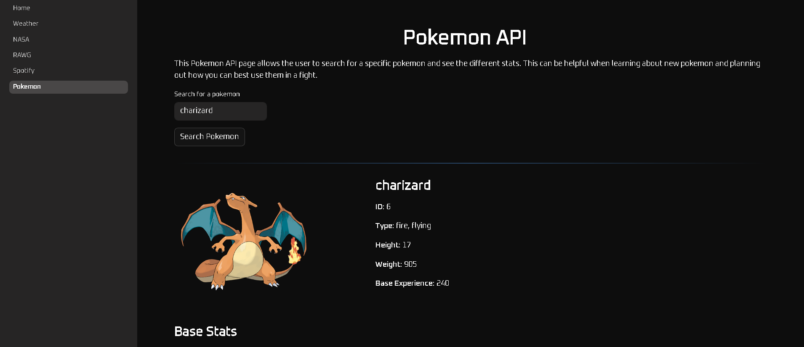
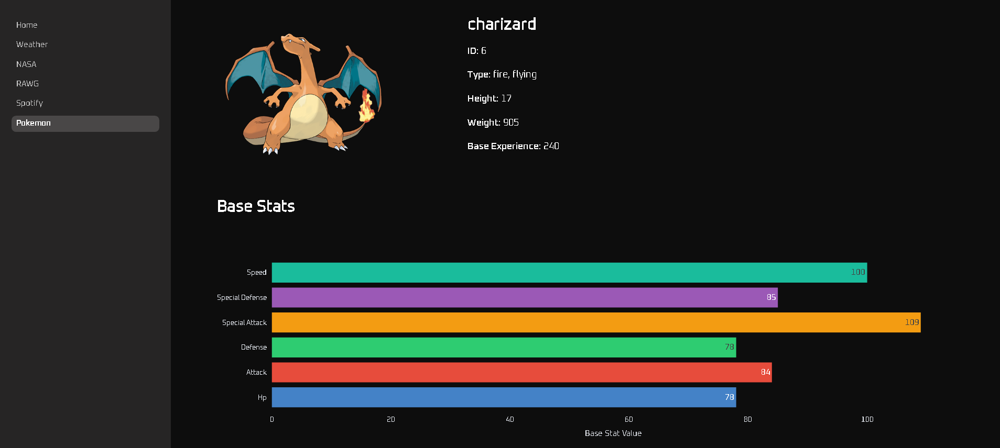

---

## Tech Stack

| Layer | Technology |
|---|---|
| Framework | Streamlit 1.56 |
| HTTP Requests | Requests 2.33 |
| Visualization | Plotly 6.7 |
| Data | Pandas 3.0 |
| Environment | python-dotenv 1.2 |
| Language | Python 3.x |

**APIs Integrated:**

| API | Auth Method | Docs |
|---|---|---|
| Open-Meteo | None (free) | https://open-meteo.com |
| NASA APOD | API Key | https://api.nasa.gov |
| RAWG | API Key | https://rawg.io/apidocs |
| Spotify Web API | OAuth 2.0 Client Credentials | https://developer.spotify.com/documentation/web-api |
| PokéAPI | None (free) | https://pokeapi.co |

---

## Project Structure

```
api_portfolio_app/
├── Home.py                  # Landing page
├── README.md
├── requirements.txt
├── .env                     # API keys (not committed)
├── .gitignore
├── .streamlit/
│   └── config.toml          # Dark theme configuration
├── assets/
│   ├── videos/
│   │   └── demo_walkthrough.mp4
│   └── images/
│       ├── profile.jpg
│       ├── home_screenshot_1.png
│       ├── home_screenshot_2.png
│       ├── weather_api.png
│       ├── nasa_api_1.png
│       ├── nasa_api_2.png
│       ├── nasa_api_3.png
│       ├── rawg_api_1.png
│       ├── rawg_api_2.png
│       ├── rawg_api_3.png
│       ├── spotify_api_1.png
│       ├── spotify_api_2.png
│       ├── pokemon_api_1.png
│       └── pokemon_api_2.png
├── pages/
│   ├── 01_Weather.py
│   ├── 02_NASA.py
│   ├── 03_RAWG.py
│   ├── 04_Spotify.py
│   └── 05_Pokemon.py
└── utils/
    ├── style.py             # Global CSS
    ├── weather_helpers.py
    ├── nasa_helpers.py
    ├── rawg_helpers.py
    ├── spotify_helpers.py
    └── pokemon_helpers.py
```

Each page imports a dedicated helper module from `utils/`, keeping display logic and API logic cleanly separated.

---

## Running Locally

**1. Clone the repository**
```bash
git clone https://github.com/<your-username>/api_portfolio_app.git
cd api_portfolio_app
```

**2. Install dependencies**
```bash
pip install -r requirements.txt
```

**3. Set up API keys**

Create a `.env` file in the project root:
```
NASA_API_KEY=your_nasa_api_key
RAWG_API_KEY=your_rawg_api_key
SPOTIFY_CLIENT_ID=your_spotify_client_id
SPOTIFY_CLIENT_SECRET=your_spotify_client_secret
```

- **NASA**: Free key at https://api.nasa.gov
- **RAWG**: Free key at https://rawg.io/apidocs
- **Spotify**: Create an app at https://developer.spotify.com/dashboard

**4. Launch the app**
```bash
streamlit run Home.py
```

The app will open at `http://localhost:8501`.

---

## Key Engineering Highlights

- **OAuth 2.0 flow** implemented from scratch for Spotify (no SDK) — Client Credentials exchange returning a short-lived bearer token used per request
- **Retry logic** on NASA APOD calls to handle transient 503 failures gracefully
- **Geocoding pipeline** on the Weather page converts free-text city input to lat/lon before hitting the forecast endpoint
- **Consistent styling** via a shared `style.py` utility that injects custom CSS (dark theme, Google font, card/badge components) across all pages
- **Clean separation of concerns** — every page is a thin UI layer; all API calls and data shaping live in isolated helper modules

---

## About

Built by **Daniel Loehnert** as part of a career transition from Data Analyst to full-stack developer. This project demonstrates the ability to work with external APIs, handle authentication, transform and visualize data, and build interactive web applications in Python.

[](https://github.com/<your-username>)
